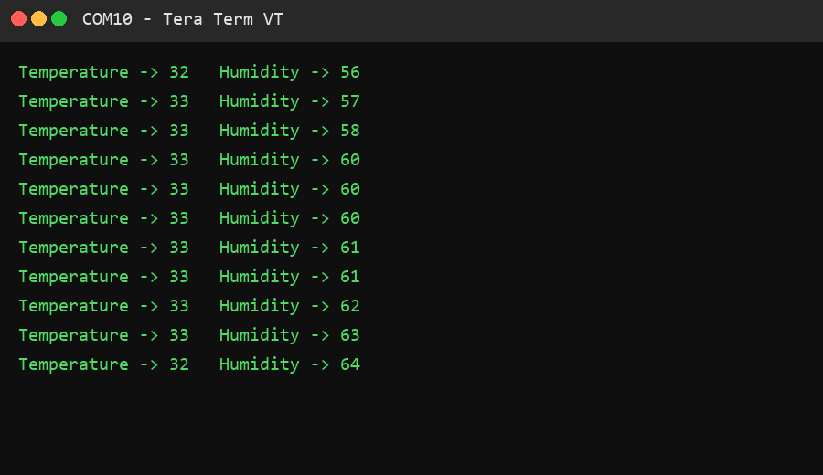

# SmartAir TX – Temperature & Humidity Monitoring System

An embedded system application built using STM32 and FreeRTOS that periodically reads temperature and humidity data from a DHT11 sensor and transmits the data via UART every 3 seconds.

## Overview

SmartAir TX is a simple environmental monitoring system designed using an STM32 microcontroller. The system reads real-time temperature and humidity data using the DHT11 sensor and prints the values over UART.

The project demonstrates practical use of:

- FreeRTOS task scheduling
- Inter-task communication using queues
- Synchronization using semaphores and mutex
- Periodic timer based task triggering
- UART communication for debugging and monitoring

## Hardware Used

- STM32 Development Board
- DHT11 Temperature and Humidity Sensor
- USB-UART Interface

## Software Used

- STM32CubeIDE
- FreeRTOS
- HAL Drivers

## System Architecture

The system consists of three main components:

### Timer
A FreeRTOS software timer triggers every 3 seconds.

### Sensor Task
Reads temperature and humidity values from the DHT11 sensor.

### Print Task
Receives sensor values through a queue and prints them via UART.

## RTOS Components Used

### Tasks
- `SensorTask` – Reads sensor data
- `PrintTask` – Prints data to UART

### Queue
Used for passing temperature and humidity values between tasks.

### Semaphore
Binary semaphore used for timer synchronization.

### Mutex
Used to protect UART access to avoid race conditions.

### Software Timer
Triggers every 3 seconds to initiate sensor data transmission.

## Working Flow

1. The FreeRTOS timer triggers every 3 seconds.
2. Timer releases a semaphore.
3. SensorTask reads temperature and humidity from the DHT11 sensor.
4. SensorTask sends the data to a queue.
5. PrintTask receives the data from the queue.
6. UART mutex ensures safe printing.
7. Temperature and humidity values are printed on the serial terminal.

### Example Output

```
Temperature -> 28
Humidity -> 64
```



## Key Learning Outcomes

- FreeRTOS task scheduling
- Queue based inter-task communication
- Mutex for shared resource protection
- Periodic timer handling in RTOS
- Sensor interfacing with STM32
- UART based data logging
